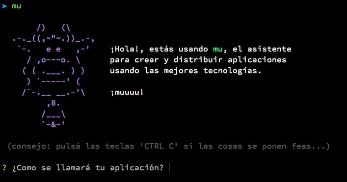

# huayra-app

Un asistente para crear la estructura inicial
de proyectos, inspirado en yeoman y ember-cli.

## Características

 - Soporta la creación de plantillas para html5, ember y pilas.
 - Genera la estructura del paquete para debian y huayra.
 - Incorpora scripts para editar la aplicación en modo live-reload.
 - Tiene una bateria de [tests](https://travis-ci.org/hugoruscitti/huayra-mu).
 - No afecta la capa de ozono.

## Instalación

Lo primero que tenes que hacer es clonar el repositorio con este
comando:

	git clone https://github.com/hugoruscitti/huayra-mu

Después, hay que ingresar en el directorio de la aplicación e instalar
las dependencias para que todo funcione correctamente. Ejecutá lo
siguiente:

	npm install

Por último, la aplicación se ejecuta así:

	./bin/mu
